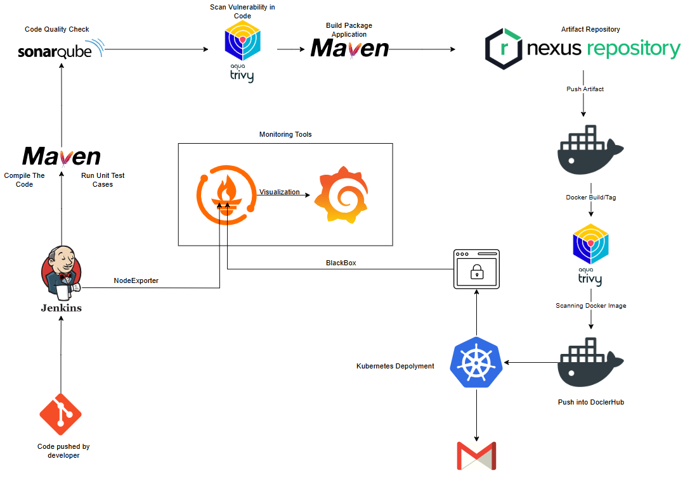
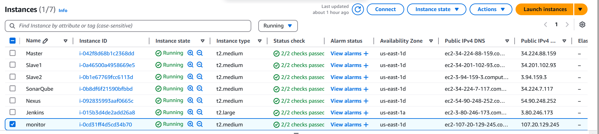
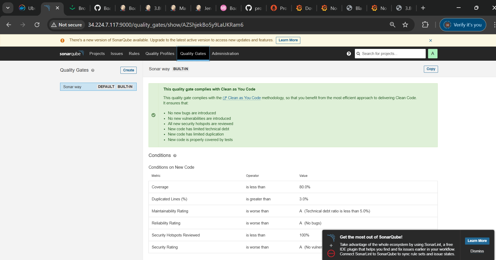

**Cloud-Native CICD Pipeline Automation - BoardGame Web Hosting**

#### **Project Overview**

{width="6.5in" height="4.513888888888889in"}

This project demonstrates the implementation of a fully automated CI/CD
pipeline for a web application using Jenkins, Docker, Kubernetes,
SonarQube, Nexus, and monitoring tools (Prometheus, Grafana). The
pipeline automates the process of building, testing, deploying, and
monitoring a containerized application, ensuring that quality checks and
security scans are conducted throughout the pipeline.

#### **Technologies Used**

-   **Cloud Platform**: AWS EC2 (for hosting the infrastructure)

-   **CI/CD Tool**: Jenkins

-   **Version Control**: GitHub

-   **Containerization**: Docker

-   **Container Orchestration**: Kubernetes

-   **Build & Test Tool**: Maven, Trivy, SonarQube

-   **Artifact Repository**: Nexus

-   **Monitoring**: Prometheus, Grafana

-   **Communication Protocols**: SSH, Kubernetes API

-   **Email Notification**: Gmail App Passwords (for Jenkins email
    notifications)

#### **Infrastructure Setup**

##### **Servers and Software Installed:**

{width="6.5in" height="1.4583333333333333in"}

1.  **Jenkins Server**:

    -   Jenkins installed with necessary plugins (Docker, Kubernetes,
        SonarQube, Maven, etc.).

    -   Docker and Trivy installed for building and scanning Docker
        images.

2.  **Kubernetes Cluster** (3 AWS EC2 instances):

    -   1 master and 2 slave nodes with Kubernetes installed and
        configured.

3.  **SonarQube and Nexus Servers**:

    -   Docker containers for SonarQube and Nexus to manage code quality
        and store built artifacts.

4.  **Monitoring Tools**:

    -   Prometheus and Grafana for monitoring application performance.

    -   Blackbox Exporter for probing websites and monitoring response
        times.

##### **Network Configuration:**

-   **Security Groups** assigned for required ports (application,
    Kubernetes API, SSH, etc.).

{width="6.5in" height="2.0277777777777777in"}

-   **Credentials** for secure communication between Jenkins,
    Kubernetes, Nexus, and SonarQube.

{width="6.5in" height="2.2916666666666665in"}

-   **Kubernetes Authentication**: Service accounts and roles set up for
    Jenkins to interact with Kubernetes securely.

#### **Pipeline Development and Automation**

##### **Phase 1: Infrastructure Setup**

-   Set up and configured EC2 instances for Jenkins, Kubernetes master
    and slave nodes, SonarQube, and Nexus.

-   Installed Docker, Kubernetes, and necessary tools on all servers.

-   Created Docker containers for SonarQube and Nexus.

-   Installed and configured Prometheus, Grafana, Node Exporter and
    Blackbox Exporter for monitoring.

##### **Phase 2: GitHub Integration**

-   **Cloned the Boardgame repository** into a private GitHub
    repository.

-   **Created a GitHub token** for Jenkins integration to access the
    repository securely.

##### **Phase 3: Jenkins Pipeline Setup**

-   **Installed Jenkins Plugins**:

    -   Eclipse Temurin, Maven, SonarQube Scanner, Docker, Kubernetes,
        etc.

    -   Configured tools for JDK, SonarQube Scanner, Maven, and Docker.

-   **Jenkins Pipeline Script**:

    -   **Git Checkout**: Pull source code from GitHub repository.

    -   **Compile & Test**: Compile the source code using Maven and run
        tests.

    -   **Trivy Scan**: Perform a file system scan to check for
        vulnerabilities.

    -   **SonarQube Analysis**: Integrate SonarQube for code quality
        analysis.

    -   **Quality Gate**: Wait for the quality gate to pass before
        proceeding.

    -   **Build**: Build the Maven artifact (jar/war file).

    -   **Publish to Nexus**: Deploy the artifact to Nexus repository.

    -   **Build and Tag Docker Image**: Build and tag a Docker image for
        deployment.

    -   **Docker Image Scan**: Scan the Docker image for vulnerabilities
        using Trivy.

    -   **Push Docker Image**: Push the Docker image to Docker Hub.

    -   **Deploy to Kubernetes**: Use Kubernetes credentials to deploy
        the app to the Kubernetes cluster.

    -   **Verify Deployment**: Verify that the deployment and service
        are successfully running in Kubernetes.

    -   **Email:** Send the necessary files to the personal gmail

##### **Kubernetes Setup:**

-   **Creation of Kubernetes:** Kubernetes created using kubeadm on VM's
    on AWS Cloud

-   **Create Service Account**: Jenkins service account for Kubernetes
    interaction.

-   **Role and RoleBinding**: Define the roles and role bindings to
    grant necessary permissions.

-   **Token Generation**: Generate a token for Jenkins to authenticate
    with Kubernetes.

-   **Deployment YAML**: Define Kubernetes deployment and service for
    the Boardgame application.

#### **Problems Faced During Execution**

1.  **Kubernetes Authentication Issues**: Resolved by ensuring the
    service account token was correctly configured and added to Jenkins
    credentials.

2.  **Docker Build Failures**: Fixed by optimizing Dockerfiles and
    ensuring that dependencies were correctly defined.

3.  **SonarQube Quality Gate Failures**: Fixed by addressing code
    quality issues identified in the SonarQube scan before proceeding to
    the next stages.

4.  **Nexus Authentication Errors**: During the artifact publishing
    stage, the pipeline encountered authentication errors when
    attempting to deploy the artifact to Nexus. The error message
    indicated an issue with the credentials or repository configuration.
    Verified the Nexus repository URL and ensured the correct
    credentials were configured in Jenkins. Additionally, checked the
    pom.xml file to ensure the correct repository credentials (username,
    password) were specified for both release and snapshot versions.

#### 

#### **Snippets Of the Project**

1.  Web Application

> {width="6.5in" height="3.4166666666666665in"}

2.  Sonarqube

> {width="6.5in"
> height="3.486111111111111in"}{width="6.5in"
> height="3.4166666666666665in"}
>
> {width="6.5in" height="3.4166666666666665in"}

3.  Nexus

> {width="6.5in" height="2.75in"}

4.  Prometheus

> {width="6.5in" height="3.236111111111111in"}

5.  Grafana

> {width="6.5in" height="1.7222222222222223in"}
>
> {width="6.5in" height="3.2916666666666665in"}
>
> {width="6.5in" height="3.2222222222222223in"}
